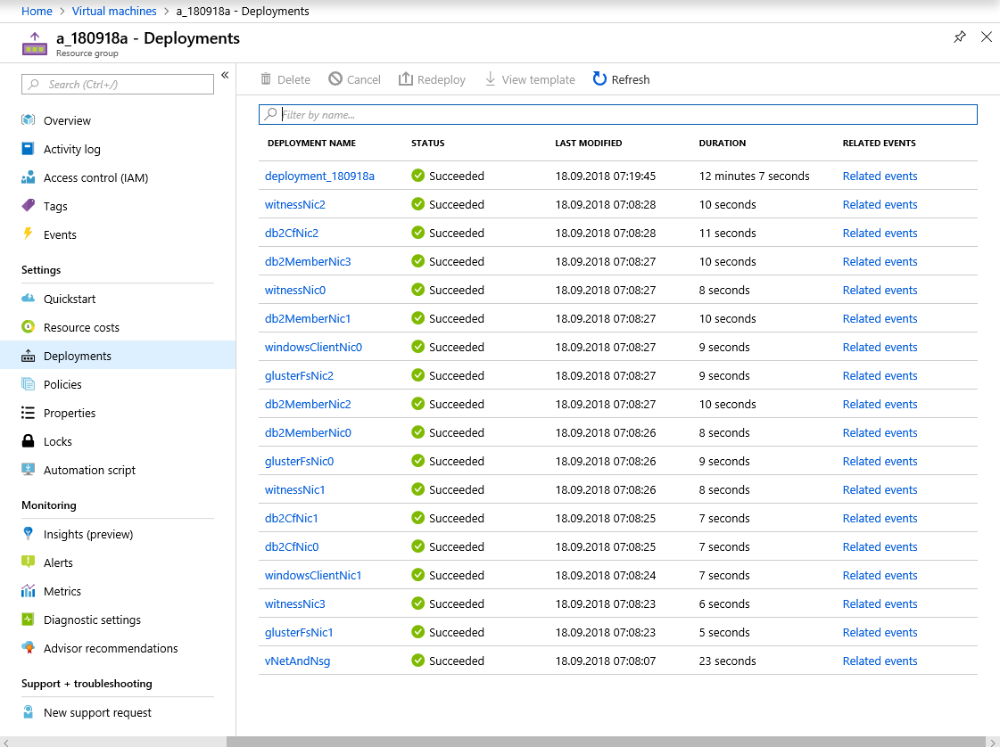
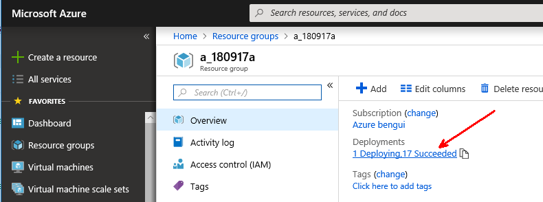
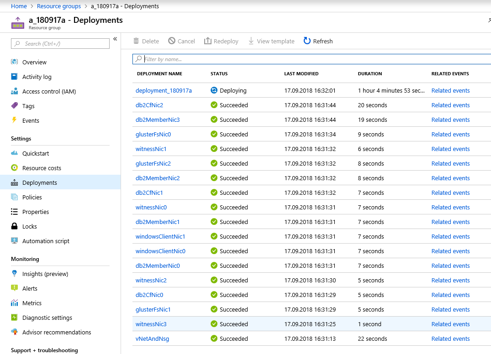

# Deploy

The [deployment script](../deployment/deploy.sh) needs a number of variables we have to prepare. 
Here is the list (excerpt from the usage part of the script):
- subscription (-s): Azure subscription name"
- resourceGroupName (-g): Azure resource group name"
- location (-l): Azure region where the resources will be created"
- deploymentName (-n): Azure region where the resources will be created"
- pubKeyPath (-k): path to the public key to be used for jumpbox access"
- adwinPassword (-p): password for the 'adwin' user on Windows boxes"
- db2bits (-d): location where the 'v11.1_linuxx64_server_t.tar.gz' file can be downloaded from. You should manually download it from https://www.ibm.com/analytics/us/en/db2/trials/ first, then copy it somewhere like on Azure storage."
- gitrawurl (-u): folder where this repo is, with a trailing /. E.g.: https://raw.githubusercontent.com/benjguin/db2onAzure/master/"
- jumpboxPublicName (-j): jumpbox public DNS name. The full DNS name will be <jumpboxPublicName>.<location>.cloudapp.azure.com."
- temp local folder (-t) for ssh keys and other files, with a trailing /."
- acceleratedNetworkingOnGlusterfs (-a). Should the Gluster FS NICs have accelerated networking enabled? Possible values: true or false."
- acceleratedNetworkingOnDB2 (-c). Should the DB2 NICs have accelerated networking enabled? Possible values: true or false."
- acceleratedNetworkingOnOthers (-e). Should the other NICs have accelerated networking enabled? Possible values: true or false."
- lisbits (-b). location where the 'lis-rpms-4.2.4-2.tar.gz' file can be downloaded from. You can first manually download it from https://www.microsoft.com/en-us/download/details.aspx?id=55106"
- nbDb2MemberVms (-y) - nb of DB2 member VMs - default is 2"
- nbDb2CfVms (-z) - nb of DB2 caching facilities (CF) VMs - default and recommended value is 2 (the deployment was not tested with less and may not be supported with 3 or more as there is only 1 primary CF role and 1 secondary CF role)"


## init the variables

```
source 01init.sh
```

## Run the deployment script

```bash
cd $localGitFolderpath/db2OnAzure/deployment
date
./deploy.sh -s "$subscription" -g "$rg" -l "$location" -n "$deploymentName" -k "$pubKeyPath" -p "$adwinPassword" -d "$db2bits" -u "$gitrawurl" -j "$jumpboxPublicName" -t "$tempLocalFolder" -a "$acceleratedNetworkingOnGlusterfs" -c "$acceleratedNetworkingOnDB2" -e "$acceleratedNetworkingOnOthers" -b "$lisbits" -y $nbDb2MemberVms
date
```

Typical deployment time for the ARM templates are:



After the ARM templates are deployed, there are also additional scripts running.

You can find an example of what the terminal reads in [sample_deployment_log.txt](sample_deployment_log.txt).

## Follow up the deployment

In order to follow the deployment, you can issue commands like the following in another terminal, where you also executed `source 01init.sh`:

```bash
az group deployment list -g $rg
az group deployment operation list -g $rg --name $deploymentName --output jsonc --query "[?properties.provisioningState != 'Succeeded']"
```

The equivalent is also available in the portal. Search for the resource group, then for the deployments in it:





In that case, this shows that the deployment itself takes too long.

You can try to connect to the first VM (the jumpbox) and check some logs in the `/tmp` folder:

```bash
ssh rhel@$jumpbox
ll /tmp/*.log
tail /tmp/custom-scripts-from-ARM.log
for i in d0 d1 cf0 cf1 g0 g1 g2
do
    echo -----------------------------------------
    echo $i
    echo -----------------------------------------
    ssh $i "tail /tmp/custom-scripts-from-ARM.log"
    echo
    echo -----------------------------------------
    echo
done
```

## Cancel a deployment

One of the best ways to cancel the deployment is to stop the script, then destroy the whole resource group:

```bash
echo $rg
az group delete -g $rg
```
