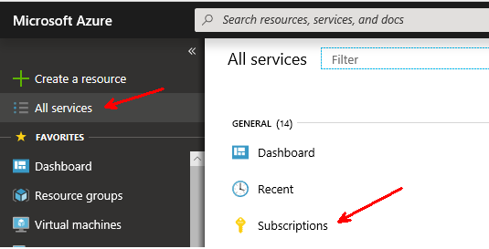
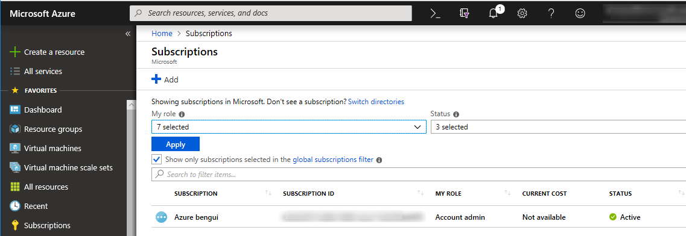
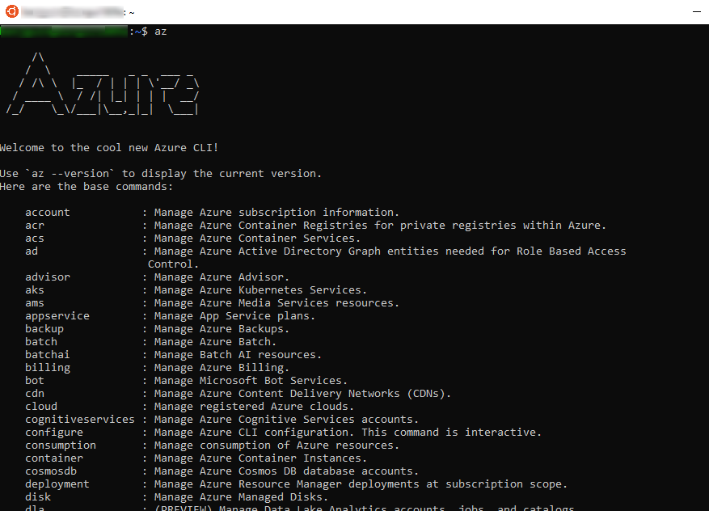
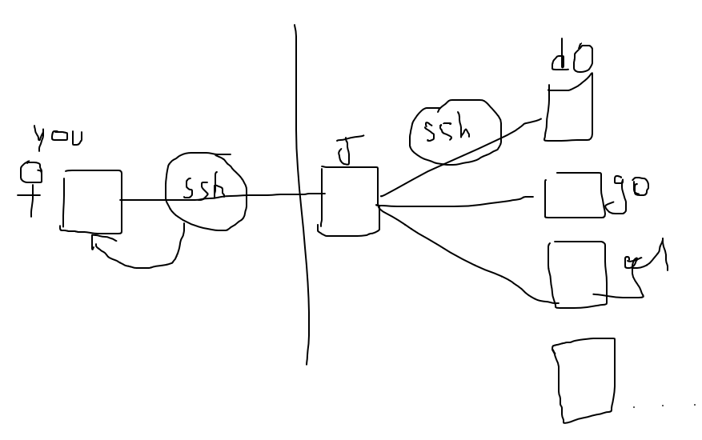
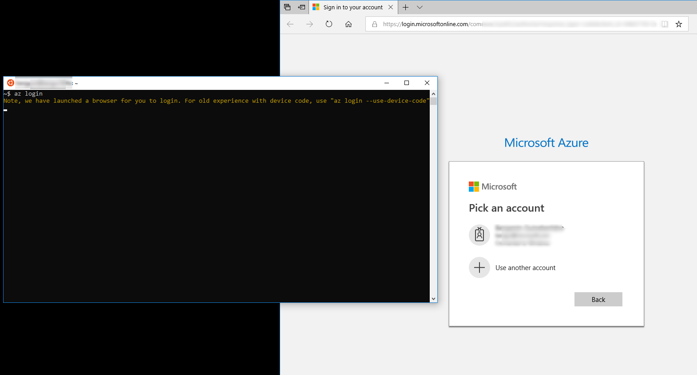
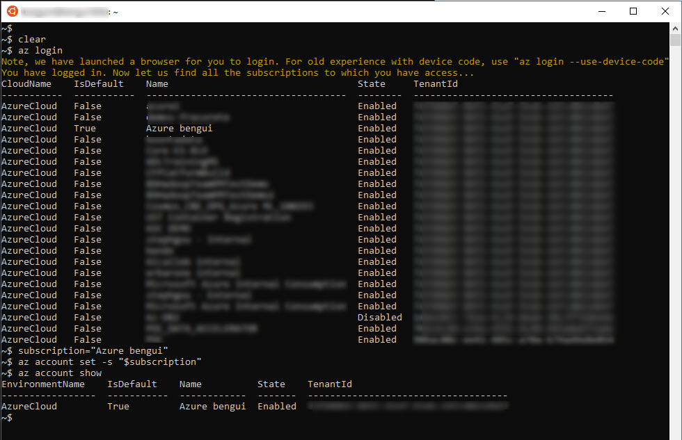

# Setup your Azure environment

## Get an Azure subscription

You'll need an Azure subscription. 

You can get one by contacting your sales representative, or go to <https://azure.microsoft.com> and follow a `Start free` or `Free account` link in the page. 

Once you've created it, you shoud be able to go to <https://portal.azure.com> and browse to the subscriptions:



This is where yu will find the subscription name (`Azure bengui` in this case) and the subscription id which is a Globally Unique Identifier or GUID.




## install the `az` CLI tool in a bash environment

You will also need to have an azure command line interface called the az CLI. This CLI can be used in different environments like the MAC, Windows CMD, Windows PowerShell or Linux. This repo uses bash as the scripting language so we need a bash environment where the az CLI will be installed. 

There is also a pure cloud environment where you can find the az CLI available right from the browser: <https://shell.azure.com>. More on this here: [Overview of Azure Cloud Shell](https://docs.microsoft.com/en-us/azure/cloud-shell/overview).

This documentation was written by using a Windows 10 Subsystem for Linux with Ubuntu 16.04.5 LTS (Xenial) version, but there are a number of alternative environments on which this should also work. 

The documentation to install the Azure CLI is here: [Install Azure CLI 2.0](https://docs.microsoft.com/en-us/cli/azure/install-azure-cli?view=azure-cli-latest)

If you use Ubuntu, go to [Install Azure CLI 2.0 with apt](https://docs.microsoft.com/en-us/cli/azure/install-azure-cli-apt?view=azure-cli-latest)

Once you have installed it, you should have something like this:




or in text mode:

```
~$ az

     /\
    /  \    _____   _ _  ___ _
   / /\ \  |_  / | | | \'__/ _\
  / ____ \  / /| |_| | | |  __/
 /_/    \_\/___|\__,_|_|  \___|


Welcome to the cool new Azure CLI!

Use `az --version` to display the current version.
Here are the base commands:

    account           : Manage Azure subscription information.
    acr               : Manage Azure Container Registries for private registries within Azure.
    acs               : Manage Azure Container Services.
    ad                : Manage Azure Active Directory Graph entities needed for Role Based Access
                       Control.
    advisor           : Manage Azure Advisor.
    aks               : Manage Azure Kubernetes Services.
    ams               : Manage Azure Media Services resources.
    appservice        : Manage App Service plans.
    backup            : Manage Azure Backups.
    batch             : Manage Azure Batch.
    batchai           : Manage Batch AI resources.
    billing           : Manage Azure Billing.
    bot               : Manage Microsoft Bot Services.
    cdn               : Manage Azure Content Delivery Networks (CDNs).
    cloud             : Manage registered Azure clouds.
    cognitiveservices : Manage Azure Cognitive Services accounts.
    configure         : Manage Azure CLI configuration. This command is interactive.
    consumption       : Manage consumption of Azure resources.
    container         : Manage Azure Container Instances.
    cosmosdb          : Manage Azure Cosmos DB database accounts.
    deployment        : Manage Azure Resource Manager deployments at subscription scope.
    disk              : Manage Azure Managed Disks.
    dla               : (PREVIEW) Manage Data Lake Analytics accounts, jobs, and catalogs.
    dls               : (PREVIEW) Manage Data Lake Store accounts and filesystems.
    dms               : Manage Azure Data Migration Service (DMS) instances.
    eventgrid         : Manage Azure Event Grid topics and subscriptions.
    eventhubs         : Manage Azure Event Hubs namespaces, eventhubs, consumergroups and geo
                       recovery configurations - Alias.
    extension         : Manage and update CLI extensions.
    feature           : Manage resource provider features.
    feedback          : Send feedback to the Azure CLI Team!
    find              : Find Azure CLI commands.
    functionapp       : Manage function apps.
    group             : Manage resource groups and template deployments.
    identity          : Managed Service Identities.
    image             : Manage custom virtual machine images.
    interactive       : Start interactive mode.
    iot               : Manage Internet of Things (IoT) assets. Augmented with the IoT extension.
    iotcentral        : Manage IoT Central assets.
    keyvault          : Manage KeyVault keys, secrets, and certificates.
    lab               : Manage Azure DevTest Labs.
    lock              : Manage Azure locks.
    login             : Log in to Azure.
    logout            : Log out to remove access to Azure subscriptions.
    managedapp        : Manage template solutions provided and maintained by Independent Software
                       Vendors (ISVs).
    maps              : Manage Azure Maps.
    monitor           : Manage the Azure Monitor Service.
    mysql             : Manage Azure Database for MySQL servers.
    network           : Manage Azure Network resources.
    policy            : Manage resource policies.
    postgres          : Manage Azure Database for PostgreSQL servers.
    provider          : Manage resource providers.
    redis             : Manage dedicated Redis caches for your Azure applications.
    relay             : Manage Azure Relay Service namespaces, WCF relays, hybrid connections, and
                       rules.
    reservations      : Manage Azure Reservations.
    resource          : Manage Azure resources.
    role              : Manage user roles for access control with Azure Active Directory and service
                       principals.
    search            : Manage Azure Search services, admin keys and query keys.
    servicebus        : Manage Azure Service Bus namespaces, queues, topics, subscriptions, rules
                       and geo-disaster recovery configuration alias.
    sf                : Manage and administer Azure Service Fabric clusters.
    snapshot          : Manage point-in-time copies of managed disks, native blobs, or other
                       snapshots.
    sql               : Manage Azure SQL Databases and Data Warehouses.
    storage           : Manage Azure Cloud Storage resources.
    tag               : Manage resource tags.
    vm                : Manage Linux or Windows virtual machines.
    vmss              : Manage groupings of virtual machines in an Azure Virtual Machine Scale Set
                       (VMSS).
    webapp            : Manage web apps.
~$

```

## make sure you have your personal ssh keys

You have to have your personal key that will give you access to the jumpbox. This can be done with a command like `ssh-keygen`.

By default `ssh-keygen` will generate a key pair: 
- the private key is in the `~/.ssh/id_rsa` file
- the public key is in the `~/.ssh/id_rsa.pub` file.

You should create a key pair with no pass phrase, because the script needs to connect to the jumpbox in an unattended way (see line `ssh -o StrictHostKeyChecking=no rhel@$jumpbox "bash -v /tmp/fromjumpbox.sh $nbDb2MemberVms $nbDb2CfVms $acceleratedNetworkingOnDB2 &> >(tee -a /tmp/postARM.log)"` in `deploy.sh`). 

This is why the `01init.sh` example has this line: `pubKeyPath=~/.ssh/id_rsa.pub`, which means you will authenticate with that default key to the jumpbox in Azure.

NB: The deployment script also creates a key pair that will be sent to the jumpbox and authorized by all the other nodes inside the deployment.



Picture: courtesy of Stephane!

Your SSH keypair is used for the authentication between your local laptop and the jumpbox. 
Then you become user `rhel` on the jumpbox and you can jump to any other node.

One advantage is that, if Bob has access to the jumpbox, he can authorize Alice to connect to the jumpbox by adding here public key to the `rhel@$jmpbox:~/.ssh/authorized_keys`.
Once this is done, Alice has access to the whole platform.

## login and set the right subscription

Set a variable with your subscription name or subscription ID. For example: 

```bash
subscription="Azure bengui"
```

Then you need to login, set the subscription and check this is the right one:

```bash
az login
az account set -s "$subscription"
az account show
```

Here is an example of how this happens:





The rest of the documentation assumes you have already logged in.
