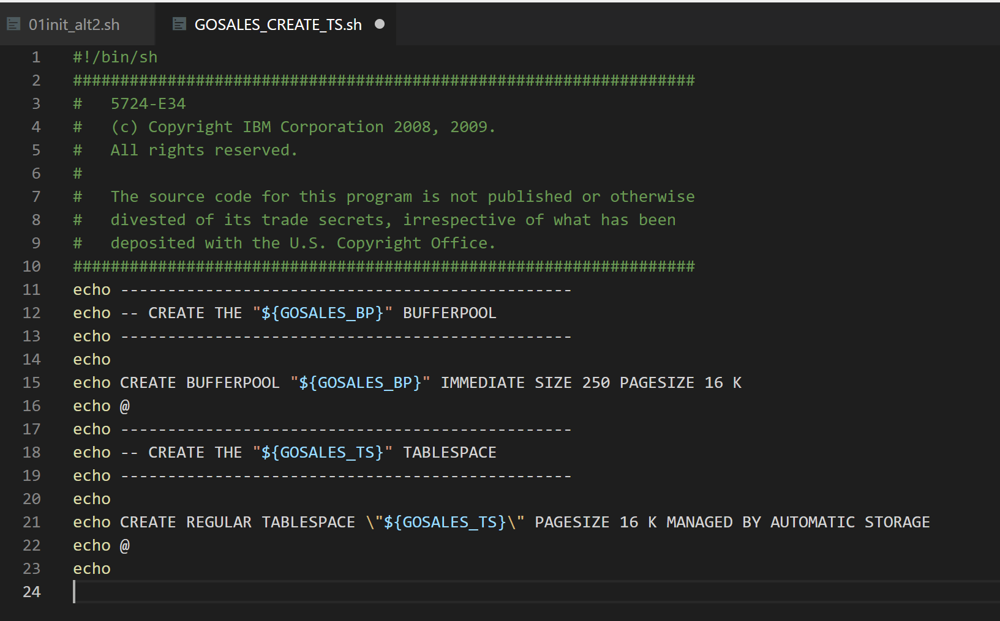
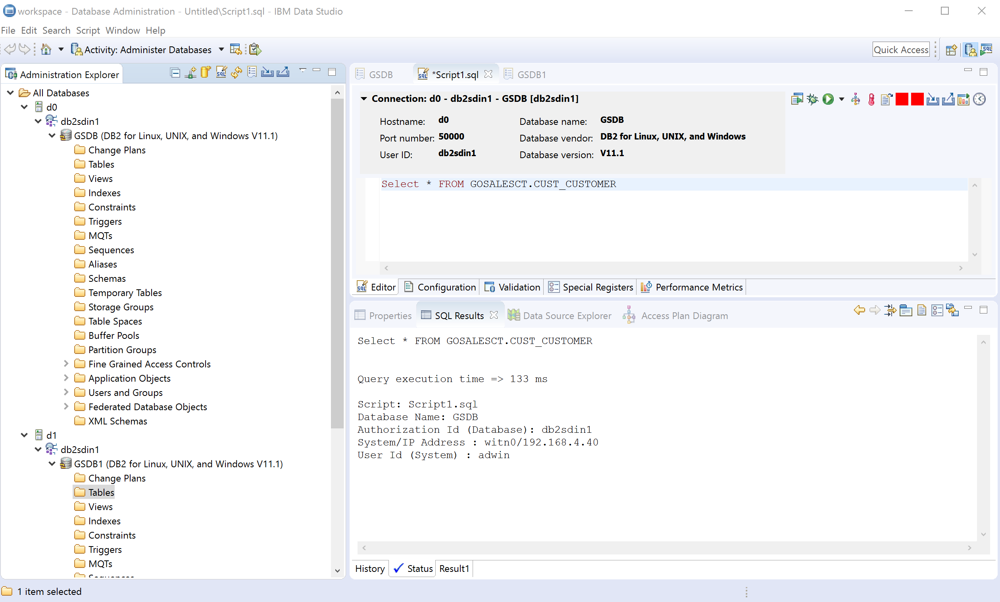

# Install the IBM GSDB sample database

install the IBM GSDB sample database to get started:

 [IBM GSDB sample database](https://www.ibm.com/support/knowledgecenter/SS62YD_4.1.1/com.ibm.sampledata.go.doc/topics/setup.html).


## Download GSDB bits to d0 


For this environment you can download the bits directly to d0:

```bash
$ ssh rhel@$jumpbox
[rhel@jumpbox ~]$ ssh d0
[rhel@d0~]$ sudo su - db2sdin1
[db2sdin1@d0 ~]$ wget ftp://ftp.software.ibm.com/software/data/sample/GSDB_DB2_LUW_ZOS_v2r3.zip .
[db2sdin1@d0 ~]$ unzip GSDB_DB2_LUW_ZOS_v2r3.zip
[db2sdin1@d0 ~]$ cd DB2
[db2sdin1@d0 DB2]$ cd unix
[db2sdin1@d0 unix]$ chmod u+x setupGSDB.sh
```


## Make the bits work on DB2 pureScale 

Edit `GOSALES_CREATE_TS.sh` in vi to avoid error: 

```bash
SQL1419N  The statement, clause, command, API, or function is not supported in a DB2 pureScale environment. Reason code = "1".  SQLSTATE=56038
```

Open the script in Vi:

```bash
[db2sdin1@d0 unix]$ cd GS_SCRIPTS
[db2sdin1@d0 GS_SCRIPTS]$ vi GOSALES_CREATE_TS.sh
```

Change Line 21 to:

```bash
echo CREATE REGULAR TABLESPACE \"${GOSALES_TS}\" PAGESIZE 16 K MANAGED BY AUTOMATIC STORAGE
```
The code look like this:



## Now you are ready to install

```bash
[db2sdin1@d0 unix]$ ./setupGSDB.sh -createDB -noprompt
```

## Check the installation 

verify the GSDB Database is installed and activate :

```bash
[db2sdin1@d0 ~]$ db2 list database directory

 System Database Directory

 Number of entries in the directory = 1

Database 1 entry:

 Database alias                       = GSDB
 Database name                        = GSDB
 Local database directory             = /db2sd_1804a/db2sdin1
 Database release level               = 14.00
 Comment                              = v.3.002.001 UTF8 07/21/2009
 Directory entry type                 = Indirect
 Catalog database partition number    = 0
 Alternate server hostname            =
 Alternate server port number         =

[db2sdin1@d0 ~]$ db2 activate database GSDB
DB20000I  The ACTIVATE DATABASE command completed successfully.
```
### Connect with IBM data Studio 

Both nodes will have the GSDB database and are ready to take queries:


