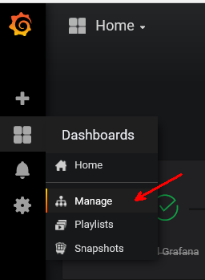
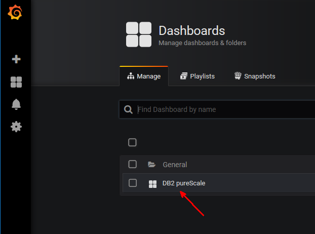
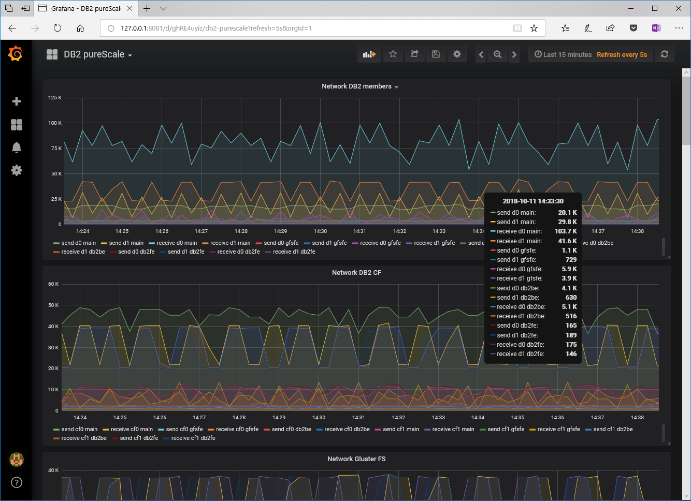

# Create a monitoring VM once the ARM template was deployed

Here is how you can add monitoring (based on Grafana and Prometheus) as part of your deployment.

## Create the VM 

```bash
source 01init.sh
```

Create the new monitoring VM with the following characteristics:
- IP address in `main` subnet: `192.168.0.50`
- VM size: Standard DS3 V2, like the other VMs
- cloudinit so that it is a docker host where Grafana and Prometheus containers will be added

```bash
az network nic create -g "$rg" --name "monitoring_main_nic" --vnet-name "db2vnet" --subnet "main" --network-security-group "db2vnet_nsg" --private-ip-address "192.168.0.50"

scp rhel@$jumpbox:~/.ssh/id_rsa.pub /tmp/jumpbox_id_rsa.pub
jumpboxSshPubKey="`cat /tmp/jumpbox_id_rsa.pub`"
rm /tmp/jumpbox_id_rsa.pub

cat > /tmp/cloudinit1.yml << EOF
#cloud-config

package_upgrade: true

users:
  - name: rhel
    ssh-authorized-keys:
      - $jumpboxSshPubKey

    sudo: ['ALL=(ALL) NOPASSWD:ALL']
    groups: sudo,docker
    shell: /bin/bash

packages: 
  - docker-ce

apt:
  preserve_sources_list: true

  sources:
    curtin-dev-ppa.list:
      source: "deb [arch=amd64] https://download.docker.com/linux/ubuntu \$RELEASE stable"
      keyid: 0EBFCD88 # cf https://docs.docker.com/install/linux/docker-ce/debian/#set-up-the-repository

power_state:
  delay: "now"
  mode: reboot
  message: First reboot
EOF

az vm create -g "$rg" --name "monitoring" --image "Canonical:UbuntuServer:16.04-LTS:latest" --size "Standard_DS3_v2" --admin-username rhel --nics monitoring_main_nic --custom-data /tmp/cloudinit1.yml

rm /tmp/cloudinit1.yml

cd "$localGitFolderpath/db2OnAzure/deployment/monitoring/monitoringVMContent"
tar -czvf /tmp/monitoring.tar.gz ./
scp /tmp/monitoring.tar.gz rhel@$jumpbox:/tmp/
rm /tmp/monitoring.tar.gz

ssh rhel@$jumpbox
sudo bash -c 'echo "192.168.0.50 monitoring" >> /etc/hosts'
scp /tmp/monitoring.tar.gz rhel@monitoring:/tmp/
rm /tmp/monitoring.tar.gz
ssh monitoring
tar -xzvf /tmp/monitoring.tar.gz
rm /tmp/monitoring.tar.gz

sudo curl -L https://github.com/docker/compose/releases/download/1.18.0/docker-compose-`uname -s`-`uname -m` -o /usr/bin/docker-compose
sudo chmod +x /usr/bin/docker-compose
sudo chmod a+x grafana/setup.sh

docker-compose up -d
docker-compose ps
docker-compose logs
```

NB: to stop:

```bash
docker-compose stop
docker-compose rm -f
```

## install node exporters to the monitored VMs

```bash
ssh rhel@$jumpbox

ssh rhel@$jumpbox

cat > /tmp/install_node_exporter.sh <<'EOF1'
#install node_export for Prometheus monitoring

systemctl stop firewalld
systemctl disable firewalld
systemctl status firewalld
#TODO: replace by something like this, with the right zones
#firewall-cmd --zone=public --add-port=9100/tcp
#firewall-cmd --reload

wget https://github.com/prometheus/node_exporter/releases/download/v0.16.0-rc.1/node_exporter-0.16.0-rc.1.linux-amd64.tar.gz
tar -zxvf node_exporter-0.16.0-rc.1.linux-amd64.tar.gz
mv node_exporter-0.16.0-rc.1.linux-amd64/node_exporter /usr/local/bin/

adduser prometheus
cat <<EOF > /etc/systemd/system/node_exporter.service
[Unit]
Description=Node Exporter

[Service]
User=prometheus
ExecStart=/usr/local/bin/node_exporter

[Install]
WantedBy=default.target
EOF

systemctl daemon-reload
systemctl start node_exporter.service
systemctl enable node_exporter.service
systemctl status node_exporter.service
EOF1

for vm in g0 g1 g2 d0 d1 cf0 cf1 witn0
do
    scp /tmp/install_node_exporter.sh ${vm}:/tmp/
    ssh $vm "sudo bash /tmp/install_node_exporter.sh &> >(tee -a /tmp/install_node_exporter.log)" &
done
```

metrics can be seen from any of the monitored nodes thru this command:

```bash
curl localhost:9100/metrics
```

add an NSG rule

```bash
az network nsg rule create --nsg-name db2vnet_nsg -g $rg --name allow-mon --description "allow Prometheus monitoring" --protocol tcp --priority 300 --destination-port-range "9100"
```

## connect to Grafana

```bash
ssh -L 127.0.0.1:8081:192.168.0.50:3000 rhel@$jumpbox
```

then go to <http://127.0.0.1:8081/>

NB: you could also connect **from wcli0** to <http://192.168.0.50:3000/>

connect with `admin` / `admin`

you will be asked to change the password. Choose a password.

A dashboard should be available:








## Remove the monitoring VM only

```
source 01init.sh

az vm list -g $rg
az vm show -g $rg --name monitoring
az vm delete -y -g "$rg" --name "monitoring"
az network nic delete -g "$rg" --name "monitoring_main_nic"
```
