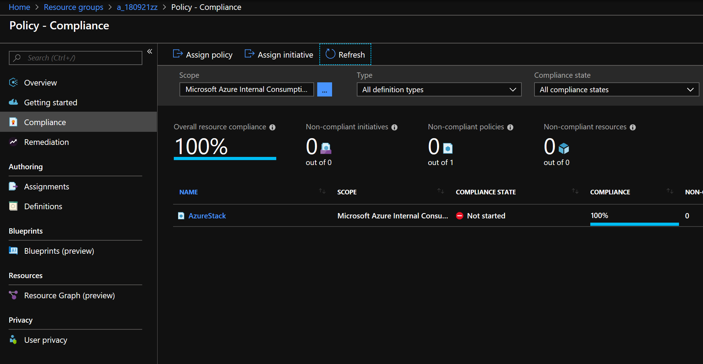

# Azure Stack

The current deployment templates are using managed disks. Deploying to Azure Stack using these templates require Azure Stack Build 1808 or higher because of the support for managed disks.

Details about Azure Stack managed disk support can be found [here](https://docs.microsoft.com/en-us/azure/azure-stack/user/azure-stack-manage-vm-disks).


## Azure Stack configuration feasibility using AzureStackPolicy

Working in Azure allows to apply an AzureStackPolicy to a resource group in order to validate configuration feasibility for the used resources on Azure Stack

[1] How to configure the Azure Stack Policy Module can be found [here](https://docs.microsoft.com/en-us/azure/azure-stack/user/azure-stack-policy-module)


## Configure AzureStackPolicy for the deployment

In order to configure the AzureStackPolicy for the deployment you have to create the resource group before you run the deployment. The deployment is generating a resource group based on the following pattern where you have to provide `${dateid}` as unique identifier in `01init.sh`

```bash
rg="a_${dateid}"
```

Example:

```bash
dateid="180921zz"
```
In this case you have to create a resource group with the naming pattern `a_180921zz`and follow the instructions in [1] to deploy the policy to your subscription and configure it. In the Azure Portal it will look like this:



Now you ready to deploy.

Note: If you have already deployed the policy as descibed in [1] you can just apply it to the resource group using PowerShell:

```PowerShell
Add-AzureRmAccount
$rgName = 'myRG01' 
$s = Select-AzureRmSubscription -SubscriptionName "<Azure Subscription Name>"
$subscriptionID = $s.Subscription.SubscriptionId 
$policy = Get-AzureRmPolicyDefinition -Name 'AzureStackPolicyDefinition'
New-AzureRmPolicyAssignment -Name AzureStack -PolicyDefinition $policy -Scope /subscriptions/$subscriptionID/resourceGroups/$rgName 
```
