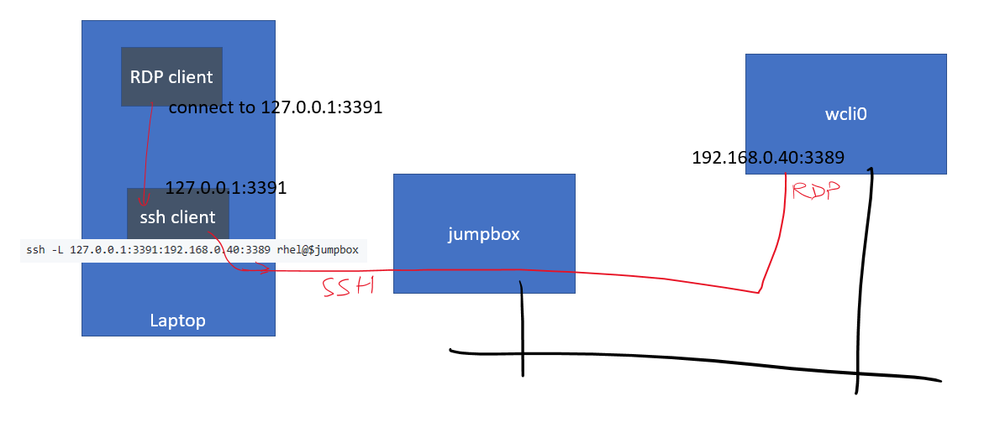

# Use the deployment

## How to connect 

First let's init the variables!

```bash
source 01init.sh
```

### Connect to the jumpbox:

```bash
ssh rhel@$jumpbox
```

### Connect to wcli0 thru an ssh tunnel:

```bash
ssh -L 127.0.0.1:3390:192.168.0.40:3389 rhel@$jumpbox
```

then connect trhu RDP to 127.0.0.1:3390

or (other example)

```bash
ssh -L 127.0.0.1:3391:192.168.0.40:3389 rhel@$jumpbox
```

then connect thru RDP to 127.0.0.1:3391

Here is a picture on how the ssh tunnel works in that case:



## Connect to DB2 pureScale cluster

If you want to connect to the DB2 database from IBM data studio installed in the Windows VM (`wcli0`), you need to setup a password for the `db2sdin1` on the DB2 member nodes.

```bash
ssh rhel@$jumpbox
ssh d0
sudo su
passwd db2sdin1<<EOF
BYlcxdcm02_____
BYlcxdcm02_____
EOF
ssh d1
passwd db2sdin1<<EOF
BYlcxdcm02_____
BYlcxdcm02_____
EOF
```

from wcli0, connect to `192.168.4.20`, and `192.168.4.21` with `db2sdin1` as a user and the password that was set.

or from a command prompt (the following example assumes you've already created a database inside the instance):

```bash
ssh rhel@$jumpbox
ssh d0
sudo su - db2sdin1
db2 get instance

db2<<'EOF'
SELECT COUNT(*) FROM t10k
EOF
```

and other DB2 commands.

## How to create a database inside the instance

```bash
ssh rhel@$jumpbox
ssh d0
sudo su - db2sdin1 # use db2user instead for single VMs

db2 get instance
db2 list database directory
# next line may take a few minutes
db2 create database test1 
db2 list database directory
db2 activate database test1
db2 connect to test1
```

## Install client tools on the Windows VM

Connect to wcli0 thru an ssh tunnel:

```
ssh -L 127.0.0.1:3390:192.168.0.40:3389 rhel@$jumpbox
```

then mstsc to 127.0.0.1:3390 with `adwin` / $adwinPassword.

- install DB2 client
    - get Download and install IBM Data Studio Version 4.1.x from IBM Web Site
        - for instance, you can download the `ibm_ds4130_win.zip` file.
        - unblock it, copy it to D;\, then unzip it
    - NB: there are 2 parts in the installation:
        - install the installer
        - use the installer to install the software
- Accept Windows updates
    - reboot
